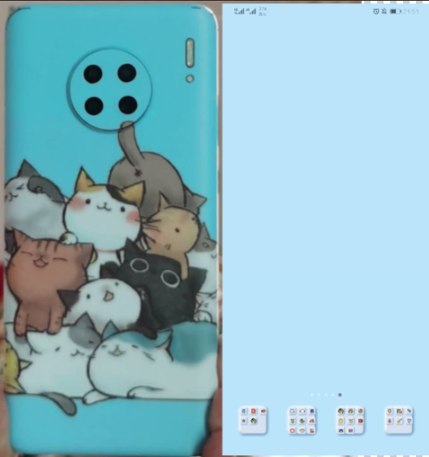
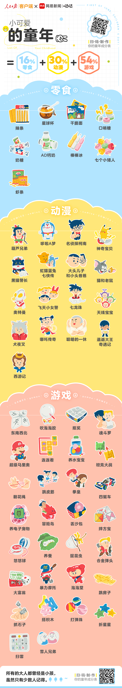

## Welcome to My GitHub Page & Daily Life

现在本科大三在读，为什么感觉巨累。

在GitHub上没有项目就太尴尬了。

CSDN博客也没有。

微博也没有。

看看豆瓣给我推荐的什么东西。

知乎推荐的东西一看就感觉停不下来，所以把知乎app卸了，用AdBlock把首页内容给屏蔽了。

所以上面这些满足不了现在的摸鱼需求，只有玩游戏好啦。

最近玩了不少游戏应该吧。

MHW玩的好心累，psp上玩的时候用片手和双手剑，玩MHW的时候忘了原来我还会片手，就一直用片手，玩到古龙的时候发现片手太难了，就看视频发现弓箭挺好的，现在的处境就是弓箭还是半吊子，片手又是无脑砍，导致打古龙非常难受。拿简单一点的monster提高弓箭熟练度，打一只的速度还可能比片手慢。这些天没玩这个游戏了。

入手了Epic正版GTA5，玩了几天后卸载了。

找到了Astroneer 1.9的资源，玩了几天，都能生产了，就差铺路铺满全球，现在发现没有好友一起玩挺无聊的。

玩这么多游戏，不累才怪。

------

5.29更新

京东真棒。昨晚下单，南昌发货，预计今天九点到三点内到，结果九点半就到了。十点半换货，十二点出库，一点发车，四点到货。非常棒了。

追更

京东物流是真的棒，从省会发货，一觉醒来，在电脑桌前屁股都没坐热，快递就到了。只是快递小哥只有一位吧，嗓门是真的大，总是会喊我名字+“快递到了”，好尴尬啊，要不下次我换个名字，让他叫我爸爸吧，哈哈，这样是不是不太好，万一他从此不喊人家名字，改为喊我地址+“快递到了”，哈哈，感觉挺有趣的。让他知道我的名字感觉也不错。

------

5.30更新

今天写点什么呢，就写今天又玩了一下MHW，不过是写完一作业之后才玩的。不知不觉玩了四把，每次都是十分钟一把，毒妖鸟，浮空龙，蛮颚龙，飞雷龙。都是用弓箭，只猫了一次。感觉还是不是很熟练，拼命的按鼠键，而且开了五个神秘珠宝，都没有耐力珠，我什么时候能获得耐力珠啊，吃了两个耐力雷虫，能使我多乱按几下，体验非常好。这个应该又要肝很久才能获得。

明天六一呢，感觉可以写点童年什么的。

5.31更新

昨天记错了，明天才是六一。

今天手机后膜到了，第一次给这部手机买壳。上一部手机只买过一次手机壳，然后戴到它退休。

手机后膜就是上面这张图左边部分。想到买手机后膜也是有原因的。这个可以追溯到半年前，那时Mate30刚发布不久，大家就开始为这个波轮洗衣机设计手机壳，其中有几款蛮好看的，比如橘色的猫和洗衣机图案，那是我还彩色打印了这个图案，然后贴到自带的透明手机壳里面，戴了一段时间就无感了。并且手机壳分为两种，一种是经典的手机壳，另一种是粘上去的手机后膜，我更想买后膜，因为我把屏幕保护模撕了，为了更好的滑动体验，如果再戴手机壳的话，再加上手机尺寸原本就大，体验应该会大大下降。但是贴后膜的话，需要加热才能贴牢，在学校里不搞吹风机这样的东西，我也就作罢，戴着自带的手机壳感觉也还不错。

后来几个月就一直没管这事。直到几天前发现华为手机主题里新增**新拟态**，看起来感觉不错，我就在花粉俱乐部里下载一款淡蓝色的（还有粉色的，我没下载，要面子）。然后我又想到了许久以前加入到购物车中的手机后膜，我这就去下单，挑来挑去就挑了同为蓝色的这款，即使这款没有与摄像头很搭配，能与我的主题搭配就够了。然后就是贴膜，这个就不多讲了，吹风机吹出来的风有点烫手。

实际上，手机厚膜没有上图中那么绿，壁纸颜色是我改过的，原主题的壁纸蓝色比较浅，可能因为手机屏幕颜色我开了鲜艳模式（不得不开），实际显示比上图中的要绿一些，所以色差并没有上图中那么大。除了手机厚膜和屏幕能显示的部分，剩下的就是大黑边了，看着还行，不是很后悔。

这款手机的屏幕是硬伤，不同角度看过去的颜色会有些许变化，以后换手机必得看这方面的测评。

6.2更新

过两天可能网络就会炸。

想改进页面显示效果，一个月后再说吧。

昨天6.1没更新，没打算更新，顾着写文档去了。这几天补一下六一。六一前我也玩了一下这个，最后游戏占比挺多的，应该是因为没有零花钱，也就没什么钱买吃的，买的吃的又基本是以前吃过的，所以零食总类挺少的。后来买手机交话费要挺多钱的，也没有想吃零食的需求，就更加不可能扩展新零食。

可以把和游戏的事情都讲一遍，这个能讲好多天了。

**东南西北**。最后一次玩这个应该是初中，那时还在向玩手机的过渡期。东南西北我肯定在四年级的时候就玩过，和同桌hwl吧。写的是什么内容忘了，一般就几个字，比如“帅”，“丑”，“发大财”什么的，想不到什么有趣的内容。每玩一次都要说一句话，那句话是什么已经忘了。折东南西北也可以折成衣服或者人，试了几次，不太像人，对折的话还像裤子，折两个就能集齐衣服和裤子。

**吹泡泡胶**。应该是在小学时候玩的。只记得一次，买了一些，在院子里玩，好像吹的蛮大的，把吹出来的一个放在房间里，没一会儿就变小了，不耐玩。这个应该是改自德国U某胶水，因为味道一样。

**扣奖**。小学时玩的，在家附近有家店就有扣奖，和哥哥去玩了一两次，好像是五毛钱一次，扣出来的都是小玩意儿，只能玩几下，几块钱就没了。

**魂斗罗**。小学初中时玩的。小学时我也没钱，因为要买游戏机，买了两个半吧，质量都挺差的，能玩个一个月不坏就不错了，感觉是在坑小学生的钱。在游戏机（MP5）里玩这个，命实在是太少了，重新开始游戏好多次，开局非常熟练，可惜在第一关很难不丢命，最后应该是没在MP5里通关。后来还买了能差游戏卡、显示在电视上、用手柄玩的游戏机，这个太棒了，就是游戏卡插槽容易松动，游戏卡也容易坏（还是那句话，坑小学生的钱）。前前后后买了不下二十张游戏卡，几百块钱吧，我能搞到这么多钱也是服了。其中就有张卡有魂斗罗，能够显示在电视上当然爽，还能双人游戏，不过我还是太菜了，打了两三个关卡就没命了。最后还是我哥通关了，我就在旁边看看，不愧是经常去游戏厅的人。除了游戏机，DVD也可以玩游戏，而且还有双游戏手柄接口，哪里能买到这些游戏设备呢，好记星、步步高等店里就有卖，没想到吧，这些店不仅卖学习机，还卖游戏机，真是有钱赚就行了，一边是家长带孩子来挑复读机，另一边是孩子偷偷摸摸来买游戏手柄。扯远了，总之，我没通关魂斗罗，也没有攻略秘籍，就简单的介绍玩魂斗罗的游戏设备，还有其他比魂斗罗更好玩的游戏。

来这里找找灵感。

**超级马里奥**。和魂斗罗一样的处境，应该玩到了关卡6-x，玩游戏并不厉害。大学里有一段时间B站给我推各种各样的超级难的马里奥，这和我童年玩的完全不一样。

**连连看**。小学时在非智能手机上玩过这个，还是用笔或指尖触屏的。一对一对的还挺好找的，就是有拐弯次数限制，还有些是翻牌连连看，记忆不行。

**养水宝宝**。二三年级玩的挺凶的。能装满一矿泉水瓶，大的能比瓶口大，一度以为有生命，可是吸水没过多久就会破裂，衰老了吧。大家之间就是比谁的大，供观赏，拿在手上并不好玩，吸足了水一捏就烂。

**坦克大战**。非智能手机和游戏机上都有吧。一个人玩不好玩，通常玩几关就太难了，游戏机上还可以自定义地图，就把基地用铜墙铁壁围起来，只要自己不挂就行，通常躲在一个死胡同里或者河对面，来个敌人发个子弹。还可以双人玩，双人也容易翻车。

**翻花绳**。讲了这么多，第二个和女生一起玩的游戏，第一个是东南西北。绳子比较关键，细的红绳最好，不能细到缝衣线、粗到携带、短到中间放不下其他人的手、长到肩膀宽。开局标准范式，只要有交叉点就能翻，直到打结，能玩挺多个回合的，甚至还能回到先前的状态。

**跳皮筋**。四五年级流行。早上八点上课，通常七点半以后才会开校门，我们就在开校门之前在校门口玩。有个瘦瘦的同学zj能框腋窝的皮筋，什么单脚，不能碰皮筋这些的，毕竟都轮流玩。一到数个人不等。在家就找两把凳子玩。挂太高又容易翻。总之是个多人游戏，只要不是跳得太烂，总会有人一起玩。

**拳皇**。在游戏厅里玩拳皇次数不多，打不赢啊。在游戏机里玩拳皇挺多的，还有挑战关卡。现在，我只记得春丽这一个角色，因为名字太好记了。已经好久没玩这个了。一般在游戏机上都是和人机打，没有街机的快感，不如玩玩其他的游戏。

**四驱车**。大的小的，有电没电的都玩过。这里的，看图片样式，是指遥控的，车宽大概十厘米。我自己掏钱买过一辆四驱车，遥控距离比较短，冲冲冲，没过多久就坏了，好像是哪里撞坏了，我还拆开来看看，坏了又没得修，得自己修，自己的水平嘛，修不好，就这样四驱车的处境有点尴尬，拿着遥控器把玩着，却不见车有丝毫响应。呼你千万遍，待你一声应。有了新玩具，丢进垃圾桶。

**养电子宠物**。有一个黄色外壳的电子宠物，料是纽扣电池。据说养到八十级就会结婚，我就养着，有些游戏可以互动，交互比较慢，只有灰白，但还可以忍受。我养到了八十级，那天早上，起床很兴奋，看看对象有没有来。可是没有等来，没有任何关于结婚的提示。我找遍所有可能有对象影子的地方，可是还是没有找到。我带着渺茫的希望在人海中寻找你，看见那个人很像你，发现却不是你，想了很久，找了很久，才发现你只存在于虚幻之间。

可怕的事情还是发生了，建模三小时忘记录屏（主题还是请别人帮忙想的）。写点开心的事。

**冒险岛**。这个也是在游戏机上玩的，我觉得还挺好玩的，和超级马里奥差不多的玩法，不过画面要精致一些。但是哥哥们好像并不喜欢玩这个游戏。我玩了冒险岛1 2 3，不知道有没有更高的版本。不过我还是菜鸡，动不动就能挂掉。算了算了。能够骑龙是最好玩的一部分，相当于多了一条命，还变大了，具有威慑力，从口里喷出哗啦啦的火焰，一招一个准，就怕敌人太快，来不及躲开。

**丢沙包**。小学时玩得贼起劲了，初中可能没时间也没朋友玩这个吧。不知道沙包是从哪里来的，我家里很少有这种东西。玩沙包里面是沙子的版本比较少，更多的是塑料什么的，还有些是带羽毛的。丢沙包我的水平还算可以，不是很容易就能被砸到，有时候还能跑得气喘吁吁，甚是欢乐。

**摔方宝**。这个我就比较菜了，别人手上方块一大把，我的手上没几个哈哈。叠方块要纸的嘛，别人撕课本，我就从来都不撕课本，用报纸什么的，现在还有一墙的课本，期待好心人能回收掉。除了方块，还可以摔卡片，不对，不应该叫摔，应该叫打。打卡片我还是不行，没别人厉害。卡片一般是游戏王，大概一元钱一包，一包四五张卡片，家里库存有一两百张，有一些银卡。说到游戏王，小学时还租CD，看了几集游戏王，然后就没看了，不怎么喜欢看这个。所以呢，对于收集卡片也没多大兴趣。所以到初中后，卡片都藏起来了，过一段时间再看看，就看看一些高等级的卡片，好厉害的样子，然而并不会玩。现在好像还没扔掉，期待好心人领走。长大后几个人又搞其了游戏王，xkx还花几百块钱买了大量的银卡，正版的吧，然而我觉得风气不行，我一下子全扔了，没有事先商量，没有事后赔偿，太绝了，难怪会招仇恨。

**悠悠球**也是小学时玩的，中学时玩小学时玩的还没扔掉的一两个。 几块钱一个的悠悠球质量一般，转不了多久，所以我买了一个十多块钱一个的，重一些，然而一下子就撞坏了，太惨了。我做不了几个动作，但是小伙伴们可以啊，在我看来是一些高难度的动作。那时还有关于悠悠球的动画片/电视剧，电视里面的人真的是厉害，能转很久，再加上特效，很厉害。应该同款悠悠球应该被炒得很贵吧，不过我并不关心这个，只要有一两个能玩的就行了，毕竟自己是菜鸡，不能怪设备不行。

待续

------

给Typora几次反馈，第一次特意翻译成英文，怕他看不懂，然后他给我回的邮件是中文，好吧。

第二次反馈就复杂多了，这个bug不是总是发生，所以交流了几次，最后他用个人邮件回我，应该是个外国人。今天我看了下Typora的鸣谢，负责简体化的第一个人的名字就是他，哇！还点进去看到了他的GitHub主页，哇！

------

助教为什么会在一分钟之内就查收邮件啊，查收的是我的未添加附件的邮件，太快了吧，我都来不及召回。

------

现在的我，课程3/8，累了累了。18天时间内需要完成剩下的5门课程，时间挺紧张的。

------

更多了解可联系pajirsp@gmail.com。

